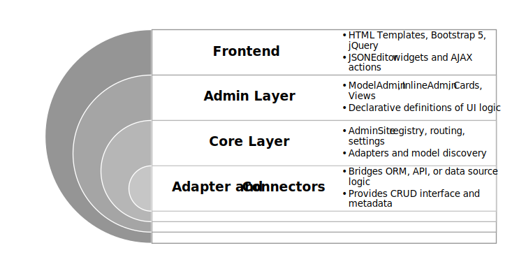

# Architecture Overview

FreeAdmin follows a layered architecture. Each layer holds a narrow responsibility and communicates with the rest through explicit contracts. Understanding these boundaries makes it easier to customise a single part of the system without rewriting the entire admin panel.


## Layers

The runtime is split into four primary layers:



### 1. Adapter / connector layer

The adapter layer connects FreeAdmin to the persistence engine. The project currently ships with a production-ready adapter for **Tortoise ORM**. Other adapters can be registered through the adapter registry when you provide your own implementation of `BaseAdapter`.

Responsibilities:

* Provide CRUD primitives such as `get`, `get_or_none`, `save`, and `delete`.
* Translate ORM-specific metadata (field definitions, verbose names) into structures understood by the admin layer.
* Expose auxiliary models including the built-in `AdminUser` and `AdminContentType` classes.

Example: registering a custom adapter so `BootManager` can load it:

```python
from collections.abc import Callable

from sqlmodel import Session, select

from freeadmin.contrib.adapters import BaseAdapter, registry


class SQLModelAdapter:
    """Adapter satisfying the :class:`BaseAdapter` protocol."""

    name = "sqlmodel"
    model_modules: list[str] = ["my_project.adapters.sqlmodel.auth"]

    def __init__(self, session_factory: Callable[[], Session]) -> None:
        self._session_factory = session_factory
        self.user_model = ...  # expose adapter-specific auth models
        self.content_type_model = ...

    def all(self, model: type) -> list:
        with self._session_factory() as session:
            return session.exec(select(model)).all()

    async def get(self, model: type, **filters):
        with self._session_factory() as session:
            return session.exec(select(model).filter_by(**filters)).one()

    # Implement the remaining methods required by ``BaseAdapter`` ...


registry.register(SQLModelAdapter(session_factory))
```

After registration you can boot the admin with `BootManager(adapter_name="sqlmodel")` and the runtime will delegate CRUD operati
ons to your adapter.

`BootManager` loads adapters lazily. When you call `BootManager(adapter_name="tortoise").init(app, packages=[...])`, the manager imports the adapter module, registers any bundled models, and makes the adapter instance available to the rest of the system.


### 2. Core layer

The core layer orchestrates discovery, routing, and permissions.

Key components include:

* `BootManager` (`freeadmin.core.boot`): initialises adapters, middleware, and FastAPI startup/shutdown hooks.
* `AdminHub` and `AdminSite` (`freeadmin.core.hub`, `freeadmin.core.interface.site`): keep registries for models, cards, views, menus, and settings pages.
* `DiscoveryService` (`freeadmin.core.interface.discovery`): scans declared packages for `app.py`, `admin.py`, and related modules that perform registrations.
* `PermissionsService` and `PermissionChecker` (`freeadmin.core.interface.services.permissions` and `freeadmin.core.interface.permissions.checker`): enforce per-model and per-action access control.

Together these services discover resources, expose HTTP routes, and wire system configuration such as settings pages and server-sent-event publishers.


### 3. Admin layer

The admin layer declares what appears in the interface and how it behaves.

* `ModelAdmin` classes define list displays, filters, search fields, and form widgets. They are instantiated when `admin_site.register(...)` is called.
* Inline editors reuse the same metadata to embed related models on detail forms.
* Dashboard cards, standalone views, and user menu entries are registered as lightweight classes or registrar helpers that call the relevant `admin_site` methods.
* Permissions can be enforced declaratively through the permission service or programmatically inside actions and views.

Example:

```python
from freeadmin.core.interface.models import ModelAdmin
from freeadmin.core.hub import admin_site
from .models import Product


class ProductAdmin(ModelAdmin):
    """Describe how Product rows appear in the admin UI."""

    list_display = ("name", "price", "available")
    search_fields = ("name",)


admin_site.register(app="catalogue", model=Product, admin_cls=ProductAdmin)
```

Each class in this layer is pure metadata — it does not talk to the database directly.


### 4. Frontend layer

The visual components are implemented with a small set of dependencies:

* Bootstrap 5.3 for layout and theming.
* Choices.js for advanced select widgets.
* Select2 for relational dropdowns used by legacy templates.
* JSONEditor for complex JSON fields.
* jQuery for lightweight DOM interactions.
* JSBarcode for barcode rendering.

Templates live under `freeadmin/templates/` and are rendered through Jinja2. They read the metadata prepared by the admin site context builders to decide which columns, filters, cards, and widgets to display.


## Runtime flow

1. **Boot.** `BootManager.init(app, packages=[...])` configures middleware, sessions, and startup/shutdown hooks on your FastAPI instance.
2. **Discovery.** `DiscoveryService` walks through the provided packages, importing modules that register models, cards, and custom views.
3. **Registry setup.** Admin modules call `admin_site.register`, `admin_site.register_view`, or `admin_site.register_card` to populate the runtime registries.
4. **Finalisation.** On FastAPI startup the admin site finalises content types, prepares cached menus, and starts card publishers.
5. **Serving.** Requests flow through FastAPI routes where CRUD endpoints delegate to the adapter while templates render the UI based on admin metadata.


## Modularity in action

Each layer can be replaced or extended:

* Write a custom adapter by subclassing `BaseAdapter` and registering it with `freeadmin.contrib.adapters.registry`.
* Provide an alternative router if you want to mount the admin under another ASGI application.
* Add bespoke widgets or cards by extending the templates and registering new entries via the admin site.
* Hook into the boot process to add extra startup or shutdown handlers on your FastAPI app.

This modularity lets you start with a single model admin and grow into an extensive administrative dashboard as your project evolves.
