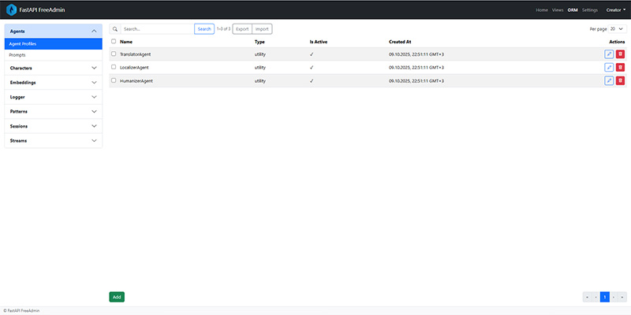

# What is FreeAdmin

**FreeAdmin** is a declarative administration framework for Python projects.  
It provides a universal way to describe and render administrative interfaces — independent of any specific web framework or ORM.


## A Modern Alternative to Django-Admin

FreeAdmin borrows the **clarity and philosophy** of Django-Admin but removes its hard dependencies.  
You can plug it into any environment — **FastAPI**, **Tortoise ORM**, **SQLAlchemy**, or your own storage layer — using a simple adapter interface.

Where Django-Admin is tightly coupled to Django’s models and middleware,  
**FreeAdmin decouples** these concerns into a flexible architecture:

```

┌──────────────────────────────┐
│           AdminSite          │
│     central registry & UI    │
├──────────────────────────────┤
│        ModelAdmin API        │
│ declarative model management │
├──────────────────────────────┤
│      Adapter / Connector     │
│ bridges ORM or data source   │
├──────────────────────────────┤
│        Frontend Widgets      │
│  Bootstrap5 + JSONEditor UI  │
└──────────────────────────────┘

````

This layered design makes the admin system:
- **Portable:** works with any Python web stack.
- **Customizable:** every level (UI, adapter, routing) is replaceable.
- **Declarative:** minimal boilerplate, explicit configuration.
- **Composable:** pages, views, cards, and widgets are registered dynamically.

---

## Design Goals

| Goal | Description |
|------|--------------|
| **Framework Independence** | The admin logic doesn’t assume Django, FastAPI, or any specific framework. |
| **Declarative Definition** | Admins, models, and UI widgets are pure Python metadata — no templates required. |
| **Simplicity First** | The core codebase stays small and understandable. You can read it end-to-end in one sitting. |
| **Frontend Minimalism** | Uses Bootstrap 5, jQuery, Choices.js, and JSONEditor — no heavy SPA build step. |
| **Extensibility** | Each subsystem (boot, routing, widgets, adapters) is replaceable by design. |

---

## Typical Use Cases

- **FastAPI project:** embed a ready-to-use admin panel for database management.
- **Tortoise ORM / SQLAlchemy app:** introspect models and auto-generate CRUD interfaces.
- **Custom backend:** define your own `Adapter` to connect FreeAdmin to any data source.
- **Internal dashboards:** combine admin pages, cards, and widgets for operational visibility.




---

## The Philosophy Behind FreeAdmin

FreeAdmin treats admin interfaces not as web pages but as **metadata views of your system**.
Every admin class — whether it’s a model admin, card, or widget — describes *what* should be visible, not *how* it should render.

That means less coupling, clearer architecture, and the freedom to evolve your backend
without breaking your admin tools.

